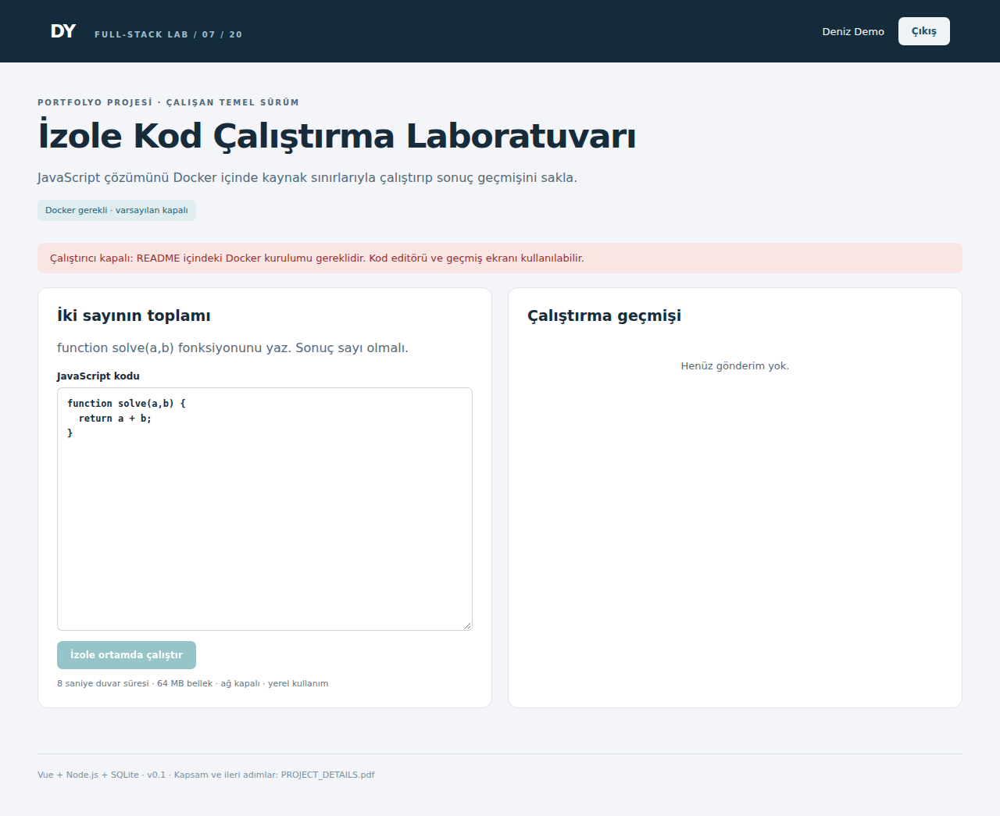

# İzole Kod Çalıştırma Laboratuvarı

JavaScript çözümünü Docker içinde kaynak sınırlarıyla çalıştırıp sonuç geçmişini sakla.



**Durum:** Çalıştırılabilir yerel temel sürüm (v0.1). Docker gerekli · varsayılan kapalı.

## Kurulum

Node.js 24.x ve npm gerekir. İlk kurulumda npm paketlerini indirmek için internet bağlantısı gerekir. Node 24 `node:sqlite` deneysel uyarısı yazabilir; bu uyarı tek başına hata değildir.

```bash
npm ci
npm run dev
```

Tarayıcı: http://localhost:3000. Giriş: **demo@example.com / Demo12345!**. İkinci hesap: **other@example.com / Demo12345!**.

İkinci terminalde, aynı proje klasöründe:

```bash
npm run seed
```

Seed komutu örnek kayıt ekler; tekrar çalıştırmak yeni örnek kayıtlar oluşturabilir. Bazı projelerde başlangıç kataloğu zaten hazırdır; seed bunu açıklar.

## Derleme ve test

```bash
npm test
npm run typecheck
npm run build
npm start
```

`npm run dev` sırasında değişiklikleri Vite işler. `npm start` için önce build gerekir. Testler RAM veritabanı ve rastgele portla çalışır; kendi verilerini oluşturur. Mevcut demo veritabanını değiştirmez. Typecheck TypeScript giriş/ortak bileşenlerini ve Vue şablonlarını kapsar; JavaScript backend'in tam tip doğrulaması değildir.

## Çalışan özellikler

- Kod editörü ve örnek problem
- Kalıcı gönderim geçmişi
- Sıralı iş kuyruğu
- Ağsız ve salt okunur container
- Süre/bellek/çıktı sınırı

## Kapsam sınırı

Docker bu teslim ortamında bulunmadığından gerçek container çalıştırma yolu burada doğrulanmadı. Varsayılan arayüz ve API kapalı runner durumunu gösterir. Tek problem vardır. Aynı süreçteki test harness kötü niyetli kod için adil/yüksek güvenlikli judge değildir; yalnız yerel eğitim içindir.

Docker Engine çalışır durumda olmalı. Önce `docker pull node:24-alpine` çalıştır. `.env` dosyasına `ENABLE_RUNNER=1` yaz; `node --env-file=.env server/index.js --dev` ile başlat. Varsayılan runner kapalıdır. Bu adaptörün gerçek container yolu teslim ortamında test edilmedi. Yerel denemede accepted, failed ve limit durumlarını ayrı doğrula.

## Dosyalar ve akış

| Dosya | Sorumluluk |
| --- | --- |
| client/Workspace.vue | Projeye özel formlar, listeler, kullanıcı eylemleri |
| client/App.vue | Oturum açma ve ortak sayfa düzeni |
| client/api.ts | Fetch, hata mesajı, para/tarih yardımcıları |
| server/project.js | Alan kuralları, SQL sorguları ve API uçları |
| server/core.js | Veritabanı, doğrulama, oturum ve SSE yardımcıları |
| server/index.js | Express başlatma, güvenlik başlıkları ve statik dosyalar |
| schema.sql | Uygulamanın gerçek tablo/indeks şeması; referans amaçlı |
| tests/project.test.js | Gerçek HTTP istekleriyle kritik iş kuralları |
| scripts/seed.js | Örnek veri ekleme |
| PROJECT_DETAILS.pdf | Beş sayfalık proje açıklaması, API, test ve geliştirme rehberi |

Arayüz → aynı origin `/api` → oturum/sahiplik/doğrulama → iş kuralı → SQLite → JSON → görünüm. SQLite `data/app.sqlite` dosyasında kalıcıdır. Bu küçük uygulamalarda tablolar açılışta `CREATE TABLE IF NOT EXISTS` ile kurulur; sürümlü migration sistemi henüz yoktur.

## İş kuralı

API işi SQLite’a queued yazar; worker tek iş alır ve geçici main.js üretir. docker run ağ kapalı, 64 MB bellek, PID sınırı ve nobody kullanıcı ile çağrılır. 8 saniye veya 8 KB çıktı sınırında container sonlandırılır. finally geçici dosyaları temizler. Docker servisini API container içine socket mount ederek açmak bu paketin çalışma modeli değildir.

## API haritası

Oturum: `POST /api/auth/login` JSON `{"email":"demo@example.com","password":"Demo12345!"}`; `GET /api/auth/me`; `POST /api/auth/logout`. Çerez HttpOnly + SameSite=Strict. Tarayıcı aynı origin kullanır.

| Yöntem ve yol | Girdi | Başarı |
| --- | --- | --- |
| GET /api/problems | Gövde yok | 200 |
| GET /api/submissions | Gövde yok | 200 |
| POST /api/submissions | JSON: code | 202 |

Uç nokta gövdelerinin somut örnekleri `tests/project.test.js` ve `scripts/seed.js` içinde bulunur. `:id` alanlarını önceki oluşturma yanıtından al. Hatalar JSON `{"error":"açıklama"}` biçimindedir; 401 giriş, 403 rol/origin, 404 kayıt/sahiplik, 409 çakışma, 422 doğrulama, 429 kota anlamına gelir. Listeler küçük yerel demo kapsamındadır; tümünde sayfalama yoktur.

```text
POST /api/submissions
{"code":"function solve(a,b){ return a+b; }"}
202 {"id":"...","status":"queued"}
Runner kapalıysa 503
```

## Kabul senaryoları

- [ ] Runner kapalıyken arayüz durumu açıkça göstermeli.
- [ ] Kod gönderme 503 ve kurulum mesajı döndürmeli.
- [ ] Kapalı runner işi queued gibi kaydetmemeli.
- [ ] Docker açık yol yerelde ayrıca doğrulanmalı: başarılı çözüm, yanlış sonuç ve süre aşımı.

## İlk gün yapacağın çalışma

Önce runner kapalı durumunu ve 503 mesajını doğrula. README’deki Docker image indirme ve ortam değişkeni adımlarından sonra yerelde örnek çözümü çalıştır.

## Sonraki geliştirmeler

- [ ] Container çalışmasını kendi makinenizde doğrula
- [ ] Worker’ı ayrı düşük yetkili hizmete ayır
- [ ] Test harness sonuç protokolünü güçlendir
- [ ] Üretim için ek izolasyon katmanı ve tehdit modeli tasarla

## GitHub sunumu

Önce kurulumu çalıştır, testleri oku ve en az bir davranışı kendin geliştir. Her gün yaptığın gerçek değişikliği açıklayan commit at. `feat: ...`, `fix: ...`, `test: ...`, `docs: ...` örnek öneklerdir. `docs/screenshot.png` başlangıç sürümünün ekranıdır; değişikliklerinden sonra kendi ekranınla güncelle.

`.gitignore`, node_modules, dist, data ve .env dosyalarını dışarıda bırakır. Veritabanını, anahtarları veya gerçek müşteri/aday belgelerini GitHub'a koyma. GitHub repo oluşturma/yükleme bu paket tarafından otomatik yapılmaz.

## Ortam ayarları

`.env.example` dosyasını `.env` olarak kopyala; dosya varsayılan npm komutlarında otomatik okunmaz. Kullanmak için `node --env-file=.env server/index.js --dev`. PORT varsayılan 3000, HOST 127.0.0.1, DB_PATH data/app.sqlite. DEMO_PASSWORD yalnız yeni veritabanında hesap oluşturulurken kullanılır; var olan parolayı değiştirmez. COOKIE_SECURE yalnız HTTPS ortamında 1 olmalı. Farklı projeleri aynı anda çalıştırırken farklı PORT kullan.

## Dağıtım notu

Bu sürüm yerel portfolyo/öğrenme içindir. Genel internete açmadan önce demo hesaplarını kaldırıp kayıt/parola sıfırlama ve gerçek kullanıcı yaşam döngüsü ekle. Tek süreç/senkron SQLite yaklaşımı yoğun trafikli hizmet için hedef mimari değildir. PostgreSQL geçişinde SQL tipleri, transaction sınırları, indeksler, migration ve yedeklemeyi ayrıca tasarla. Dockerfile genel Node uygulaması içindir; Docker runner ve FFmpeg gibi özel bağımlılıklar otomatik kurulmaz.

## Mülakat provası

Container tek başına yeterli bir güvenlik sınırı mıdır? Bir gönderim işleyicisi neden ana API sürecinden ayrılmalıdır?

## Lisans

MIT; bağımlılıkların kendi lisansları saklıdır.


## Teknik referanslar

Ayrıntılı resmî kaynaklar ana başlangıç rehberinde listelenmiştir.
